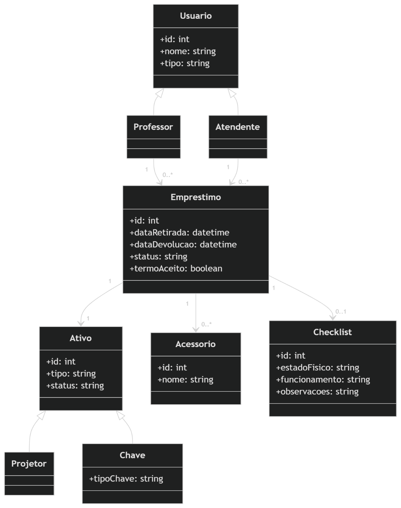
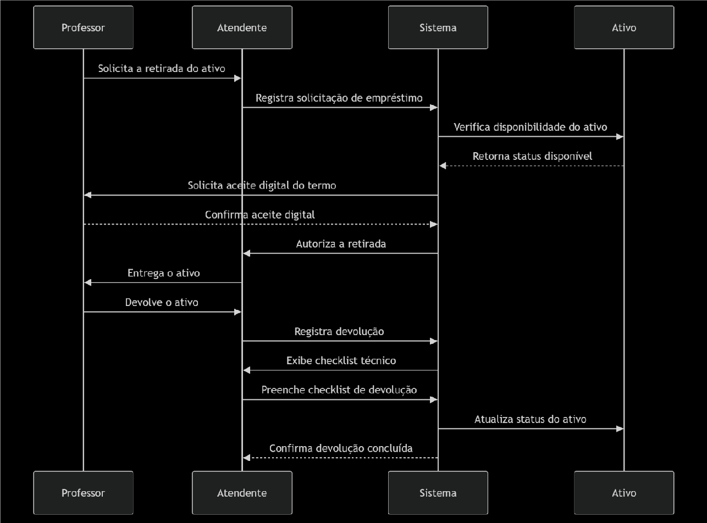
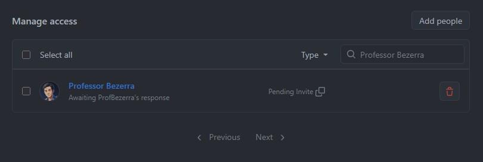
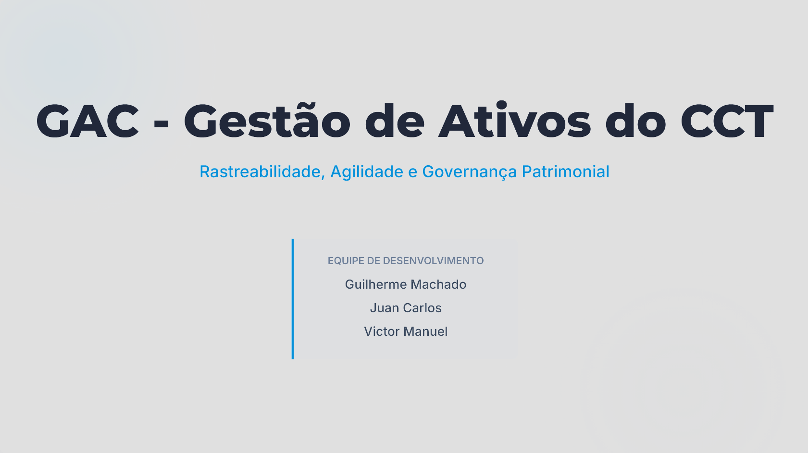

# 🏢 GAC - Gestão de Ativos do CCT

## Documento Mestre: Visão, Especificação e Casos de Uso

*Projeto de Requisitos e Modelagem de Sistemas Aplicado ao Contexto Educacional*

 

**Disciplina:** Requisitos e Modelagem de Sistemas  
**Professor:** Marcelo Bezerra  
**Grupo I:** Guilherme Machado Faria, Juan Carlos de Sousa Pereira, Victor Manuel Soares da Silva  
**Data:** Maio de 2026 | **Versão:** 1.0  
**Repositório:** [https://github.com/oshippai/requisitos-2026-gac-grupol](https://github.com/oshippai/requisitos-2026-gac-grupol)

---

# 📘 PARTE I: Visão e Elicitação (Sprint 1 e 2)

## 1. Documento de Visão do Produto (Issue #1)

### O Problema
Atualmente, a locação de projetores (um total de 36 equipamentos) e chaves no CCT é realizada de forma estritamente manual. O processo envolve cadernos de registro físico, planilhas do Google e formulários de papel separados para a retirada e a devolução. Esse modelo operacional analógico gera dores constantes para a equipe de atendimento, resultando em atrasos, erros de anotação e alto índice de retrabalho. Além disso, a ausência de um sistema centralizado cria um "ponto cego" de controle visual, dificultando o rastreio ágil de pendências, como itens não devolvidos, danos físicos aos equipamentos ou a falta de acessórios essenciais (ex: cabos HDMI).

### A Solução Proposta
O sistema GAC (Gestão de Ativos do CCT) tem como objetivo principal digitalizar e unificar a gestão do inventário. A plataforma substituirá o controle em papel por um fluxo de trabalho ágil e digital, garantindo rastreabilidade em tempo real. Isso será alcançado através da implementação de um aceite digital de responsabilidade pelos docentes e de checklists técnicos parametrizados no momento da devolução.

---

## 2. Identificação de Stakeholders (Issue #2)

O mapeamento das partes interessadas envolvidas e afetadas pelo sistema GAC é composto por:

* **Direção Estratégica:** Prof. Jackson (Diretor do CCT).
* **Gestão Administrativa/Secretaria:** Fabiana (noite) e Marcia (manhã).
* **Corpo Operacional (Atendentes):** Kildery (Auxiliar Administrativo) e equipe de apoio de 5 auxiliares.
* **Suporte Técnico:** Equipe do DTEC, responsável pelas manutenções e validação dos checklists de hardware.
* **Usuários Finais:** Corpo docente (professores) que realiza a locação diária de ativos.

---

## 3. Elicitação: Roteiro e Resultados (Issues #3 e #4)

### Log de Entrevista Operacional
* **Entrevistado:** Kildery (Auxiliar Administrativo).
* **Contexto:** 2 anos de experiência no setor J02.

**Q1: Como descreve a rotina atual de retirada de equipamentos?**
> **Resposta:** Hoje o fluxo é lento. O professor solicita o item, preenchemos um formulário físico manualmente e colhemos a assinatura no papel. É um processo burocrático e o manuseio de termos em papel gera desorganização.

**Q2: Quais são os problemas mais críticos na devolução?**
> **Resposta:** Lidamos com não devolução no prazo, retornos com danos físicos não reportados e, com muita frequência, a falta de acessórios, principalmente cabos HDMI.

**Q3: O que traria melhoria imediata para o setor?**
> **Resposta:** A adoção de tecnologia para facilitar a rotina. Precisamos de um checklist organizado por armário para validar o estado e o funcionamento real do equipamento na devolução.

---

## 4. Especificação de Requisitos e Regras

### 4.1. Requisitos Funcionais (Issue #5)
* **RF01:** O sistema deve possuir um cadastro centralizado dos 36 projetores e das chaves/salas do CCT.
* **RF02:** O sistema deve unificar os processos de retirada e devolução, eliminando formulários independentes.
* **RF03:** O sistema deve registrar acessórios (HDMI, USB) entregues com o projetor.
* **RF04:** O sistema deve permitir o preenchimento de um checklist técnico no momento da devolução.

### 4.2. Requisitos Não Funcionais (Issue #6)
* **RNF01 (Usabilidade):** Interface de "Fricção Zero" para garantir agilidade no balcão de retirada.
* **RNF02 (Segurança):** O aceite digital deve possuir a mesma validade institucional que o termo assinado atual.

### 4.3. Regras de Negócio (Issue #7)
* **RN01:** O projetor deve ser devolvido obrigatoriamente até o final do dia.
* **RN02:** É obrigatório o aceite do Termo de Responsabilidade para autorizar o empréstimo.
* **RN03:** O sistema deve gerir duas chaves por sala (original e reserva).

---

## 5. Backlog Inicial Priorizado (Issue #8)

| ID | Descrição | Prioridade |
| :--- | :--- | :--- |
| **RF01** | Cadastro centralizado de ativos (projetores e chaves) | **Alta** |
| **RF02** | Unificação do fluxo de Retirada/Devolução | **Alta** |
| **RN02** | Obrigatoriedade do aceite do Termo de Responsabilidade | **Alta** |
| **RNF02** | Validação jurídica e segurança do aceite digital | **Alta** |
| **RF04** | Checklist técnico no momento da devolução | **Média** |
| **RN01** | Regra de devolução obrigatória até o final do dia | **Média** |
| **RN03** | Controle de múltiplas chaves (Original e Reserva) | **Média** |
| **RF03** | Registro de acessórios (Cabo HDMI, USB, etc.) | **Baixa** |
| **RNF01** | Usabilidade com "Fricção Zero" (Interface rápida) | **Baixa** |

---

## 6. Modelagem UML (Issues #9, #10 e #11)

### Diagrama de Casos de Uso
Representa as interações entre os atores (Professor e Atendente) e o Sistema GAC.

### Diagrama de Classes
Modela as entidades principais do sistema (`Usuario`, `Equipamento`, `Emprestimo`, `Checklist`).

### Diagrama de Sequência
Detalha o fluxo principal de retirada e devolução do ativo no tempo.

---

## 7. Evidências e Anexos

### Acesso do Professor
Captura de tela comprovando o envio do convite de colaboração para o usuário `profBezerra` no repositório oficial da equipe.

---

## 8. Protótipo Navegável e Wireframes (Issues #15 e #16)

As telas do sistema GAC foram desenhadas e desenvolvidas focando na usabilidade de "Fricção Zero" para os operadores de balcão e em uma gestão limpa e eficiente para a administração. O projeto conta com um protótipo web de alta fidelidade interativo e wireframes complementares no Figma.

### 💻 Protótipo Interativo Unificado (Painel Administrativo e Atendente)
O protótipo principal foi construído em código (React/Tailwind) e hospedado via GitHub Pages para facilitar o teste de usabilidade em tempo real. Ele simula tanto o login do Atendente (Retirada, Devolução e Consulta) quanto o login do Administrador (Gestão de Ativos e Equipe).

> 🔗 **Acessar Protótipo Web:** [https://oshippai.github.io/requisitos-2026-gac-grupoI/](https://oshippai.github.io/requisitos-2026-gac-grupoI/)

### 📧 Wireframe: Visão do Professor (Aceite de Termo por E-mail)
Para simular a interface do usuário final, foi desenvolvido no Figma o fluxo que demonstra como o professor recebe a notificação institucional por e-mail e realiza a assinatura digital do Termo de Responsabilidade no próprio celular/computador.

> 🔗 **Acessar Visão do Professor no Figma:** [Testar o fluxo do e-mail institucional](https://www.figma.com/make/0PyyE6DtRGr04GEfKV4zFR/Email-Client-Wireframe-Design?fullscreen=1&t=pFh94Waz6zJeqBS7-1&code-node-id=0-9)

---

## 9. Pitch e Storytelling (Issues #17 e #18)

Para a apresentação final, foi desenvolvida uma narrativa estratégica (storytelling) focada no valor de negócio e na resolução de dores operacionais do CCT. O Pitch Deck detalha desde o problema do controle analógico até a viabilidade técnica e os benefícios da solução GAC.

*(Clique na imagem abaixo para visualizar a apresentação completa)*

> 🔗 **Link de Acesso:** [Visualizar Pitch Deck (Slides da Apresentação)](https://docs.google.com/presentation/d/1VxpBOoDbJC6z3NULnf96EWxmzxjiquWdt3UAQPVJIvU/edit?usp=sharing)

---
---

# 📙 PARTE II: Especificação de Requisitos de Software (SRS)
**Padrão Estrutural:** IEEE 830-1998 (Adaptado)  
**Milestone:** M2 - Especificação e Protótipo

---

## 1. Introdução

### 1.1 Propósito
O propósito deste documento é especificar os requisitos de software para o sistema **GAC (Gestão de Ativos do CCT)**. Este documento destina-se aos desenvolvedores, ao professor orientador (stakeholder avaliador), aos atendentes do setor operacional e à direção do CCT. Ele fornece a base para o design, validação e desenvolvimento do protótipo navegável.

### 1.2 Escopo do Produto
O sistema GAC digitalizará e unificará a gestão do inventário de chaves e projetores do CCT. A plataforma substituirá o controle em papel por um fluxo ágil baseado em leitura de QR Code/NFC, garantindo rastreabilidade em tempo real, emissão de termos de responsabilidade com aceite digital e checklists técnicos parametrizados na devolução.

### 1.3 Definições, Acrônimos e Abreviações
* **GAC:** Gestão de Ativos do CCT.
* **CCT:** Centro de Ciências e Tecnologia.
* **SRS:** Software Requirements Specification (Especificação de Requisitos de Software).
* **RF / RNF / RN:** Requisito Funcional / Não Funcional / Regra de Negócio.
* **DTEC:** Departamento Técnico (Responsável pelo suporte e validação de hardware).

### 1.4 Visão Geral do Documento
Este documento está dividido em três partes principais: a Introdução (Seção 1), a Descrição Geral do sistema e seus usuários (Seção 2) e os Requisitos Específicos e Casos de Uso detalhados (Seção 3).

---

## 2. Descrição Geral

### 2.1 Perspectiva do Produto
O GAC é um sistema web/mobile independente que operará no balcão de atendimento do CCT. Ele fará a ponte entre o inventário físico (armários de projetores e chaves) e a autenticação institucional dos professores, integrando-se via leitura de etiquetas físicas (QR Code/NFC).

### 2.2 Funções do Produto
As principais funções do sistema incluem:
* Cadastro e gestão de inventário de ativos e acessórios.
* Registro rápido de retiradas via scanner.
* Geração e validação de Termos de Responsabilidade com aceite digital.
* Registro de devoluções atreladas a um checklist técnico obrigatório.

### 2.3 Características dos Usuários (Personas)
* **Atendente (Ex: Kildery):** Usuário operacional. Precisa de uma interface ágil ("Fricção Zero") para não gerar filas no balcão e de checklists de segurança para resguardar a responsabilidade sobre avarias.
* **Professor (Docente):** Usuário final. Tem pouco tempo disponível. Interage com o sistema apenas para dar o aceite digital no seu dispositivo móvel antes de retirar a chave/projetor.
* **Direção / Secretaria:** Usuários gerenciais. Precisam de acesso a relatórios de auditoria e rastreabilidade (saber quem atrasou ou danificou equipamentos).

### 2.4 Restrições Gerais
* O equipamento projetor deve ser devolvido obrigatoriamente até o final do dia letivo (Regra de Negócio).
* Nenhuma retirada de projetor patrimonial pode ser concluída sem o registro e validação jurídica do Aceite Digital.

---

## 3. Requisitos Específicos

Nesta seção, os requisitos mapeados na Sprint 1 (Elicitação) são detalhados para a Sprint de Especificação (M2).

### 3.1 Requisitos Funcionais (RF)
* **RF01:** O sistema deve possuir um cadastro centralizado dos 36 projetores e das chaves/salas do CCT.
* **RF02:** O sistema deve unificar os processos de retirada e devolução, eliminando formulários de papel independentes.
* **RF03:** O sistema deve registrar acessórios (HDMI, USB, Controle Remoto) entregues e vinculá-los ao ativo principal.
* **RF04:** O sistema deve obrigar o preenchimento de um checklist técnico (estado físico, cabos, funcionamento) no momento da devolução.

### 3.2 Requisitos Não Funcionais (RNF)
* **RNF01 (Usabilidade):** Interface "Fricção Zero" para garantir agilidade no balcão, exigindo o mínimo de cliques possíveis para um empréstimo.
* **RNF02 (Segurança):** O aceite digital do termo de responsabilidade deve possuir validade jurídica, vinculando a transação à matrícula autenticada do docente.

### 3.3 Regras de Negócio (RN)
* **RN01:** O ativo retirado deve ser devolvido obrigatoriamente até o final do dia letivo corrente da retirada.
* **RN02:** É obrigatório o aceite do Termo de Responsabilidade para autorizar o empréstimo (Bloqueio de sistema).
* **RN03:** O sistema deve gerenciar o status individualizado de duas chaves físicas por sala do CCT (Original e Reserva).

### 3.4 Especificações de Casos de Uso (CDUs)
O detalhamento das interações entre sistema e atores (Ações, Fluxos Alternativos e Exceções) encontra-se documentado separadamente no formato LAPIS.
* **Acesso:** Para ver as validações do sistema e fluxos de assinatura digital, *consulte a PARTE III abaixo.*

---
---

# 📗 PARTE III: Especificação de Casos de Uso

## Caso de Uso (CDU) - LAPIS (Adaptado para GAC)

---

## Histórico de Versões

| Data       | Versão | Descrição                                                                  | Autor             |
|------------|---------|----------------------------------------------------------------------------|-------------------|
| 02/06/2026 | 1.0     | Criação do caso de uso de retirada e empréstimo de ativo patrimonial       | Grupo I           |

---

# 1. Nome do Caso de Uso

**Registrar Retirada de Ativo**

---

# 2. Objetivo

Permitir que o atendente realize o processo de empréstimo e retirada de projetores, chaves e acessórios do CCT para um professor, validando a disponibilidade do item, a situação cadastral do docente e coletando eletronicamente o aceite obrigatório do termo de responsabilidade.

---

# 3. Tipo de Caso de Uso

| Item | Valor |
|---|---|
| Tipo do Caso de Uso | Concreto |

---

# 4. Atores

## 4.1 Primário

| Ator | Descrição |
|---|---|
| Atendente | Realiza o registro, vinculação de acessórios e liberação física do equipamento |

---

## 4.2 Secundário

| Ator | Descrição |
|---|---|
| Professor | Responsável pela solicitação e pelo aceite digital do Termo de Responsabilidade |
| Sistema Patrimonial | Responsável por validar a existência e status do ativo no inventário |
| Sistema de Autenticação | Responsável pela autenticação do atendente e do professor |

---

# 5. Precondições

| Código | Descrição |
|---|---|
| PRE01 | O atendente deve estar autenticado no sistema GAC |
| PRE02 | O equipamento deve estar cadastrado e possuir identificação física (QR Code/NFC) |
| PRE03 | O equipamento deve estar com o status “Disponível” no banco de dados |

---

# 6. Fluxo Principal

## P1. Acessar funcionalidade de empréstimo

### P1.1.
O atendente acessa o módulo de "Nova Retirada" no painel principal do sistema GAC.

---

## P2. Identificar professor solicitante

### P2.1.
O atendente insere a matrícula do professor ou realiza a leitura da carteirinha institucional (NFC).

### P2.2.
O sistema processa a identificação e realiza a busca na base de dados de usuários.

### P2.3.
O sistema apresenta na tela os dados do docente (Nome, Departamento, Foto e Status de Pendências).

---

## P3. Identificar e validar ativo (projetor/chave)

### P3.1.
O atendente realiza a leitura da etiqueta física (QR Code ou NFC) colada no ativo.

### P3.2.
O sistema identifica o equipamento patrimonial no banco de dados.

### P3.3.
O sistema apresenta os dados técnicos do ativo (Número, Modelo, Status e Acessórios Padrão).

---

## P4. Selecionar acessórios entregues

### P4.1.
O sistema exibe o checklist de saída para os acessórios.

### P4.2.
O atendente marca no sistema quais itens extras estão acompanhando o projetor (Cabo HDMI, Controle, etc.).

---

## P5. Processar Termo de Responsabilidade Digital

### P5.1.
O atendente clica em "Gerar Termo de Saída".

### P5.2.
O sistema compila os dados e gera o Termo de Responsabilidade específico.

### P5.3.
O sistema dispara instantaneamente uma notificação para o dispositivo móvel do professor logado no app GAC.

### P5.4.
O professor abre a notificação, lê o resumo e clica em "Aceitar e Assinar Eletronicamente".

### P5.5.
O sistema valida a assinatura digital (RN02).

---

## P6. Confirmar e registrar retirada

### P6.1.
O sistema atualiza a tela do atendente com a mensagem "Termo Assinado com Sucesso".

### P6.2.
O atendente clica no botão "Confirmar Liberação de Ativo".

### P6.3.
O sistema registra a transação completa no banco de dados.

---

## P7. Finalizar operação

### P7.1.
O sistema altera o status do ativo de "Disponível" para "Emprestado".

### P7.2.
O sistema gera o comprovante eletrônico de retirada.

### P7.3.
O atendente entrega fisicamente o equipamento e os acessórios ao professor.

---

# 7. Fluxos Alternativos

## A1. Falha na leitura do QR Code/NFC do Ativo

### A1.1.
O sistema não identifica o QR Code ou a etiqueta está danificada.

### A1.2.
O atendente realiza busca manual digitando o número de tombamento patrimonial.

### A1.3.
O fluxo retorna ao passo P3.2.

---

## A2. Professor sem dispositivo móvel para assinatura

### A2.1.
O professor informa que está sem celular, sem bateria ou sem internet.

### A2.2.
O atendente seleciona a opção "Assinatura via Totem/Balcão".

### A2.3.
O sistema exibe o Termo de Responsabilidade no tablet voltado para o professor no balcão.

### A2.4.
O professor insere sua senha institucional diretamente no tablet do balcão para validar o aceite.

### A2.5.
O fluxo retorna ao passo P5.5.

---

# 8. Fluxos de Exceção

## E1. Professor com pendência ativa

### E1.1.
No passo P2.3, o sistema identifica que o professor possui um ativo em atraso não devolvido.

### E1.2.
O sistema exibe mensagem de erro [MSG002] e bloqueia o botão de prosseguir.

### E1.3.
O atendente informa ao professor sobre o bloqueio.

### E1.4.
O caso de uso é encerrado sem sucesso.

---

## E2. Equipamento não disponível

### E2.1.
No passo P3.2, o sistema identifica que o ativo lido consta como "Emprestado" ou "Manutenção".

### E2.2.
O sistema exibe mensagem de erro [MSG003].

### E2.3.
O atendente descarta o item, seleciona outro ativo físico e o fluxo retorna ao P3.1.

---

## E3. Recusa do Termo de Responsabilidade

### E3.1.
No passo P5.4, o professor clica em "Recusar Termo" ou o tempo limite de aceite expira.

### E3.2.
O sistema cancela a operação pendente e exibe mensagem de alerta [MSG004].

### E3.3.
O atendente retém o equipamento no balcão.

### E3.4.
O caso de uso é encerrado sem sucesso.

---

# 9. Pós-condições

| Código | Descrição |
|---|---|
| POS01 | O equipamento e seus acessórios mudam para o status "Emprestado" |
| POS02 | A movimentação de saída é registrada com data, hora, matrícula do professor e do atendente |
| POS03 | O Termo de Responsabilidade assinado digitalmente é arquivado |

---

# 10. Requisitos Não Funcionais

| Código | Requisito |
|---|---|
| RNF01 | O fluxo de biometria/leitura no balcão deve exigir o mínimo de cliques ("Fricção Zero") |
| RNF02 | O método de armazenamento da assinatura do termo deve garantir validade jurídica institucional |
| RNF03 | O disparo da notificação para o celular do professor deve ocorrer em até 3 segundos |

---

# 11. Ponto de Extensão

## PE1. Registrar Notificação de Atraso
Permite o agendamento automático de um e-mail de cobrança caso o sistema atinja o fim do dia letivo e o fluxo de devolução não tenha sido iniciado para este ativo.

---

# 12. Frequência de Utilização

| Item | Informação |
|---|---|
| Frequência | Alta |
| Perfil de Uso | Utilização constante pelos atendentes, concentrada nos inícios de turno letivo (manhã/noite) |
| Informações mais acessadas | Matrícula do professor, QR Code do ativo, Status de assinatura |

---

# 13. Interface Visual

## IV1. Tela de Registro de Retirada

### Leiaute da Tela

Tela utilizada pelo atendente para identificar o solicitante, bipar o ativo e gerenciar o envio do termo.

---

## 13.1 Campos da Interface

| Campo | Tipo/Formato | Obrigatório | Descrição | Regra de Negócio |
|---|---|---|---|---|
| Matrícula do Atendente | Texto (20) | Sim | Identificação do atendente | Deve possuir permissão ativa |
| Data/Hora da Retirada | Data/Hora | Sim | Momento da locação | Gerado automaticamente |
| Matrícula do Professor | Texto (20) | Sim | Identificação do docente | Não pode ter pendências |
| Leitura QR Code | QR Code | Sim | Identificação do patrimônio | Deve estar "Disponível" |
| Número Patrimonial | Texto (20) | Sim | Código do ativo | Obtido via QR Code ou manual |
| Cabo HDMI | Checkbox | Não | Acessório entregue | Vincula ao termo gerado |
| Cabo de Energia | Checkbox | Não | Acessório entregue | Vincula ao termo gerado |
| Controle Remoto | Checkbox | Não | Acessório entregue | Vincula ao termo gerado |
| Status da Assinatura | Ícone/Texto | Sim | Indica se o termo foi aceito | Bloqueia entrega se falso |
| Botão “Gerar Termo” | Botão | Sim | Dispara notificação | Habilitado após ler professor e ativo |
| Botão “Confirmar Liberação” | Botão | Sim | Finaliza retirada | Habilitado apenas após aceite digital |
| Botão “Cancelar” | Botão | Não | Cancela operação | Libera o ativo no sistema |

---

## 13.2 Navegabilidade

| Ação | Resultado |
|---|---|
| Ler QR Code válido | Sistema carrega os dados do ativo e habilita seleção de acessórios |
| Inserir Professor com Pendência | Sistema bloqueia tela e exibe mensagem MSG002 |
| Clicar em Gerar Termo | Sistema envia notificação e altera status da assinatura para "Aguardando" |
| Confirmar Liberação | Sistema registra saída e altera status do ativo para "Emprestado" |

---

## 13.3 Mensagens Previstas

| Código | Mensagem |
|---|---|
| MSG001 | Retirada autorizada e registrada com sucesso |
| MSG002 | Operação bloqueada: O professor possui pendências ativas |
| MSG003 | Equipamento indisponível para empréstimo neste momento |
| MSG004 | Operação cancelada: Termo de Responsabilidade recusado |

---

## 13.4 Componentes Visuais

| Área | Componente |
|---|---|
| Identificação | Leitor de Matrícula e QR Code |
| Status do Professor | Card indicativo (Verde para Liberado, Vermelho para Bloqueado) |
| Acessórios | Lista de checkboxes |
| Status do Termo | Spinner/Ícone de carregamento enquanto aguarda aceite |

---

# 14. Observações

| Código | Observação |
|---|---|
| OBS01 | A devolução obrigatoriamente exigirá a conferência dos mesmos acessórios marcados nesta tela |
| OBS02 | O app do professor deve permitir leitura prévia do contrato institucional de uso |

---

# 15. Referências

| Código | Referência |
|---|---|
| REF01 | Documento de Visão do GAC (Issues #1 a #7) |
| REF02 | Diagrama de Casos de Uso (UC04 e UC05) |
| REF03 | Modelo LAPIS de Liderança Ágil |

---

# 16. Checklist de Validação do Artefato (CDU)

## 16.1 Estrutura mínima

- [x] Nome do caso de uso iniciado com verbo no infinitivo.
- [x] Objetivo claro, direto e com foco em um objetivo principal.
- [x] Tipo do caso de uso informado.
- [x] Atores primário e secundários identificados corretamente.
- [x] Precondições registradas.
- [x] Fluxo principal completo e coerente com o objetivo.
- [x] Fluxos alternativos e de exceção definidos.
- [x] Pós-condições registradas.
- [x] Requisitos não funcionais registrados.
- [x] Pontos de extensão identificados.
- [x] Frequência de utilização estimada.

## 16.2 Qualidade da especificação

- [x] Passos escritos com linguagem simples e objetiva.
- [x] Ações descritas no presente do indicativo.
- [x] Alternância entre ação do ator e sistema está clara.
- [x] Não há ambiguidade.
- [x] Regras de negócio e mensagens referenciadas.

## 16.3 Consistência e rastreabilidade

- [x] Fluxos alternativos possuem entrada e saída explícitas.
- [x] Fluxos de exceção vinculados corretamente.
- [x] Referências internas consistentes.
- [x] Interface visual coerente com o fluxo.
- [x] Referências atualizadas.

## 16.4 Revisão final

- [x] Não há contradições entre seções.
- [x] Documento revisado.
- [x] Artefato pronto para desenvolvimento e testes.
