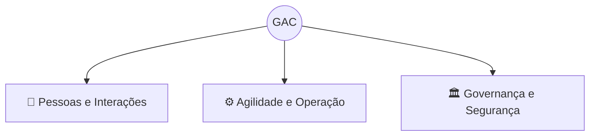

# 🏢 GAC - Gestão de Ativos do CCT

> *Rastreabilidade, Agilidade, Responsabilidade e Governança Patrimonial*

Uma plataforma digital de gestão de inventário e controle de ativos que substitui processos analógicos por um fluxo de trabalho ágil, seguro e rastreável.

**Equipe:** Guilherme Machado Faria, Juan Carlos de Sousa Pereira, Victor Manuel Soares da Silva

---

## O que é o Sistema GAC?

O GAC parte da convicção de que **o controle patrimonial não precisa ser lento**. A adoção de tecnologia deve proteger tanto o equipamento do CCT quanto o atendente que o opera diariamente.

O sistema elimina cadernos e formulários físicos, estruturando-se em **3 pilares fundamentais**, **regras de negócio estritas** e um fluxo de operação de **Fricção Zero** (com leitura de QR Code/NFC, Aceite Digital e Checklist de Devolução).

---

## Os 3 Pilares do Sistema

| Pilar | Foco | Princípio Associado |
| :--- | :--- | :--- |
| 👥 **Pessoas e Interações** | Professores e Atendentes | Resolução de atritos no balcão |
| ⚙️ **Agilidade e Operação** | Retiradas e Devoluções | Interface de "Fricção Zero" |
| 🏛 **Governança e Segurança** | Controle Patrimonial | Aceite Digital Jurídico |

---

## As 5 Funcionalidades Principais

1. **Cadastro Centralizado** — controle em tempo real dos 36 projetores, chaves originais e reservas.
2. **Leitura por QR Code/NFC** — agilidade extrema para bipar ativos e evitar filas no balcão.
3. **Termo de Responsabilidade Digital** — o professor assina e dá o aceite com validade jurídica direto pelo celular.
4. **Checklist Técnico Obrigatório** — o atendente atesta a devolução de cabos (ex: HDMI) e o funcionamento da máquina antes de finalizar o fluxo.
5. **Rastreabilidade Completa** — histórico detalhado de empréstimos, acabando com o "ponto cego" do papel.

---

## Convicção Final

> O controle em papel não escala e gera "pontos cegos".
> Responsabilidade exige registro jurídico e clareza.
> Agilidade no balcão é uma condição inegociável.
> Inspeção estruturada protege o patrimônio da instituição.

---

## Documentação Completa

O projeto completo, contendo o Documento de Visão, o Documento SRS (Padrão IEEE 830), o detalhamento das Personas, as Especificações de Casos de Uso (Modelo LAPIS), os Diagramas UML e o link do Protótipo Navegável, está disponível no arquivo mestre:

📄 [ProjetoGAC.md](ProjetoGAC.md)
