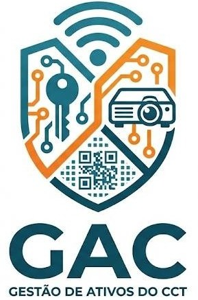
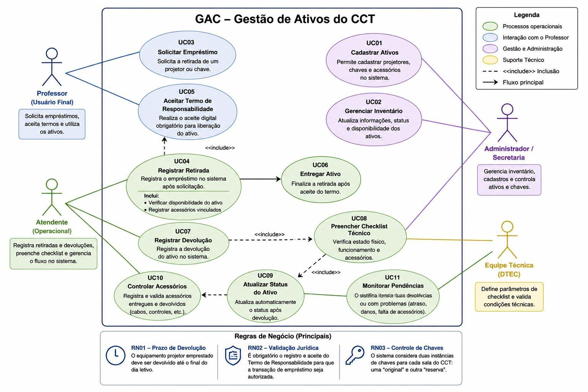
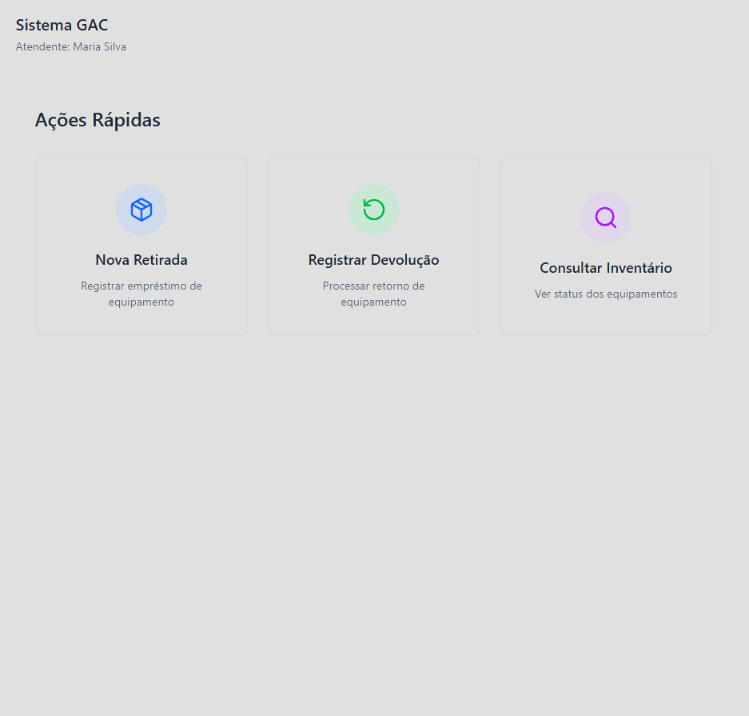

# 🏢 GAC - Gestão de Ativos do CCT

## Rastreabilidade, Agilidade, Responsabilidade e Governança Patrimonial

*Uma plataforma digital de gestão de inventário e controle de ativos*

 

**Disciplina:** Requisitos e Modelagem de Sistemas  
**Professor:** Marcelo Bezerra  
**Equipe:** Guilherme Machado Faria, Juan Carlos de Sousa Pereira, Victor Manuel Soares da Silva  
**Versão:** 1.0  

---

# 1. Visão Geral

O **Sistema GAC (Gestão de Ativos do CCT)** é uma plataforma desenvolvida para digitalizar e unificar a gestão do inventário de projetores e chaves do CCT. Ele substitui os atuais controles em papel, planilhas desconexas e cadernos físicos por um fluxo de trabalho ágil, integrado e rastreável.

Seu objetivo é garantir:
* Estabilidade e rastreabilidade operacional em tempo real.
* Eficiência e agilidade ("Fricção Zero") no balcão de atendimento.
* Sustentabilidade e governança patrimonial através de aceite digital.
* Redução drástica de retrabalho, perdas de acessórios (cabos HDMI) e danos não reportados.

O projeto parte do princípio de que **controle patrimonial não precisa ser lento**, e que a adoção de tecnologia deve proteger tanto o equipamento quanto o atendente que o opera.

---

# 2. Fundamentos do GAC

O sistema é fundamentado em quatro convicções centrais:

1. **O controle em papel não escala e gera "pontos cegos".**
2. **Responsabilidade exige registro jurídico e clareza.**
3. **Agilidade no balcão é uma condição inegociável para a adesão do professor.**
4. **Inspeção estruturada (checklists) protege o patrimônio da instituição.**

---

# 3. Estrutura do Sistema

O sistema atende a diferentes partes interessadas (Stakeholders), integrando operação e governança em três dimensões complementares.

---

## 👥 P — Pessoas e Interações
A base de uso do sistema. A interação entre quem precisa do equipamento e quem o fornece.
* **Corpo Operacional:** Kildery e equipe de 5 auxiliares (foco em controle e agilidade).
* **Usuários Finais:** Professores (foco em rapidez na retirada).
* **Suporte Técnico:** Equipe do DTEC (acionada em caso de falhas de hardware).

---

## ⚙️ A — Agilidade e Operação (Requisitos Funcionais)
A execução com disciplina. O sistema elimina a burocracia sem perder o controle.
* **Diretrizes:** Centralização do inventário e eliminação de formulários de papel.
* **Requisitos:** RF01 (Cadastro Centralizado), RF02 (Unificação de Retirada/Devolução), RF03 (Registro de Acessórios).

---

## 🏛 G — Governança e Segurança (Regras e RNFs)
A proteção institucional. Garantir que as regras do CCT sejam cumpridas automaticamente pelo sistema.
* **Diretrizes:** Responsabilidade legal sobre o equipamento e devolução no prazo.
* **Regras de Negócio e RNFs:** RN01 (Devolução no mesmo dia), RN02 (Aceite Digital Obrigatório), RNF02 (Validação Jurídica).

---

# 4. Os Princípios Operacionais (Requisitos Essenciais)

Abaixo, detalhamos os requisitos e regras de negócio essenciais do GAC, traduzidos em comportamentos do sistema:

### P1 — Interface de "Fricção Zero" (RNF01)
Professores têm pressa para iniciar suas aulas. O sistema no balcão deve exigir o mínimo de cliques possíveis, utilizando leitura rápida de QR Code/NFC.
> *"A tecnologia deve acelerar o atendimento, não criar novas filas."*

### P2 — Aceite Digital com Validade Jurídica (RN02 e RNF02)
Nenhum equipamento sai do balcão sem assinatura. O professor realiza o aceite no próprio celular.
> *"Responsabilidade patrimonial sem assinatura validada gera risco institucional."*

### P3 — Inspeção Técnica Obrigatória (RF04)
A devolução não é apenas guardar o item. O atendente é obrigado a preencher um checklist em tela atestando o funcionamento e a devolução dos cabos (HDMI/Energia).
> *"A ausência de conferência é a raiz do retrabalho e da perda de acessórios."*

---

# 5. Processo de Retirada no GAC (Especificação de Caso de Uso)

O GAC incorpora um fluxo de empréstimo contínuo e rastreável. A tabela abaixo resume a especificação do **Caso de Uso Principal (Registrar Retirada de Ativo)**, estabelecendo as ações e validações necessárias:

| Etapa | Ação do Atendente | Ação do Sistema / Professor | Saídas Esperadas |
| --- | --- | --- | --- |
| **1. Identificação** | Bipa o QR Code do ativo e insere a matrícula do professor. | Valida se o item está "Disponível" e se o professor não tem pendências impeditivas. | Dados do docente e do ativo carregados em tela. |
| **2. Checklist de Saída** | Marca os acessórios extras entregues (Cabo HDMI, Controle). | Compila os dados para geração do contrato. | Lista de itens vinculados à locação. |
| **3. Governança (Aceite)** | Clica em "Gerar Termo de Saída". | Dispara notificação. O Professor lê e assina eletronicamente no celular. | Termo de Responsabilidade validado juridicamente. |
| **4. Finalização** | Confirma a liberação e entrega fisicamente o equipamento. | Altera o status do ativo para "Emprestado" e gera comprovante. | Equipamento liberado com rastreabilidade total. |

---

# 6. Benefícios Esperados e Como Medir

Assim como no Modelo LAPIS, os benefícios do GAC são observáveis e mensuráveis para o CCT. 

| Benefício Esperado | Indicador de Medição (KPI) |
| --- | --- |
| **Redução do sumiço de acessórios** | Número de cabos HDMI/Controles repostos por semestre |
| **Maior agilidade no balcão** | Tempo médio (em segundos) para liberação de um projetor |
| **Rastreabilidade de danos** | % de equipamentos quebrados com identificação do responsável |
| **Fim do extravio de chaves** | Ocorrências de chaves "Original" e "Reserva" perdidas (RN03) |
| **Conformidade de devolução** | Taxa de equipamentos não devolvidos no mesmo dia letivo (RN01) |

---

# 7. Mapa do Sistema (Evidências e Protótipo)

O GAC foi integralmente modelado através de diagramas UML e prototipado em alta fidelidade.

### 7.1. Modelagem UML
* **Casos de Uso:** Interações de solicitação, aceite de termo e checklists técnicos.
* **Classes:** Entidades fundamentais (`Usuario`, `Equipamento`, `Emprestimo`).
* **Sequência:** O fluxo temporal da transação de locação.

### 7.2. Protótipo Navegável (Figma)
As interfaces focam na "Fricção Zero". O fluxo inclui: Tela Inicial, Retirada (com envio de termo), Devolução (com checklist) e Consulta.

*(Clique na imagem abaixo para testar o protótipo)* 

---

# 8. Considerações Finais

O GAC não propõe apenas um "aplicativo de controle", mas sim uma **mudança cultural** na forma como o CCT gerencia seus ativos. Ele oferece uma estrutura de referência técnica onde a responsabilidade não é deixada ao acaso do papel, mas garantida pelo sistema.

A digitalização do balcão de atendimento protege o operador Kildery e sua equipe, entrega agilidade ao corpo docente e fornece à Direção os dados necessários para gerir o patrimônio educacional com excelência.

> *"Equipamentos controlados geram operação previsível. Operação previsível sustenta o ensino de excelência."*

---
*Documento SRS e Visão - Milestone M2* *Equipe GAC — maio de 2026*
